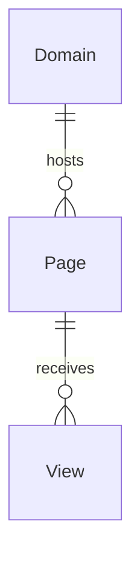

# Visita — Domain Specification

Canonical domain language for Visita, a multi-tenant web analytics tracker. Developers, reviewers, and AI agents must align code, tests, and UI copy with this document.

**Related references:** [ARCHITECTURE.md](../ARCHITECTURE.md).

**Maintenance:** When a change introduces or alters domain concepts, UI labels, or business rules, update this file **before** merging (see [.cursor/rules/domain-model.mdc](../.cursor/rules/domain-model.mdc)).

---

## Context

Visita lets site owners register **domains**, embed a tracking script, and collect **views** (sessions/page visits) for analytics dashboards. The backend is Quarkus (`dev.vepo.visita.*`); the embed script is `visita.js`.

---

## Ubiquitous Language

Terms below are the **only** approved names for aggregates, entities, states, actions, and user-visible labels unless this document is updated first.

### Platform

| Term | Meaning | Code / notes |
|------|---------|--------------|
| **Visita** | The analytics product (tracker + API + dashboard). | — |
| **Domain** | A tracked website identified by `hostname` and protected by a secret **tracking token**. May be **disabled**. Optional **ignored path patterns** exclude URL paths from tracking. | `Domain`, `tb_domains` |
| **Ignored path pattern** | Java regex matched against page URL path; views on matching paths are not recorded. | `Domain.ignoredPathPatterns`, Backoffice **Caminhos ignorados** |
| **Tracking token** | Secret sent by the embed script; paired with hostname on each tracking request. | `Domain.token`, header `VISITA-DOMAIN-TOKEN` |
| **Page** | A URL path under a domain (`/` + path). Created on first visit if the domain exists. | `Page`, `tb_pages` |
| **View** | A browsing session segment on a page: access time, optional end time, duration, referrer, user/tab ids. | `View`, `tb_views` |
| **Session** | Client-side visit lifecycle: access → optional view updates (SPA) → pings → exit. | `visita.js`, `/api/tracking/*` |
| **Referrer** | Traffic source for the view (URL, `direct`, or null). | `View.referrer` |
| **Original referrer** | External entry referrer for a tab session on a domain; propagated to in-session page views via DB trigger. Scoped per `user_id`, `tab_id`, and domain. | `View.originalReferrer` |
| **User id** | Anonymous persistent id generated by the client (`localStorage`). | `View.userId` |
| **Tab id** | Per-browser-tab id (`sessionStorage`). | `View.tabId` |
| **Duration** | Elapsed seconds on a view; extended by ping/view while active. | `View.length`, `extendDuration` |

### Actions

| Term | Meaning | Code / notes |
|------|---------|--------------|
| **Register access** | Start a new view for a page URL. | `ViewsService.registrarAcesso`, `POST /api/tracking/access` |
| **Register view** | SPA route change within a session; may end prior view and start another. | `ViewsService.registerView`, `POST /api/tracking/view` |
| **Register exit** | End a view/session (typically via sendBeacon). | `ViewsService.registrarSaida`, `POST /api/tracking/exit` |
| **Ping** | Keep-alive extending duration. | `ViewsService.registraPing`, `POST /api/tracking/ping` |
| **Enable domain** | Allow tracking for a domain. | `EnableDomainEndpoint` |
| **Disable domain** | Reject tracking token validation. | `DisableDomainEndpoint` |
| **Regenerate token** | Issue a new tracking token (invalidates old embed snippets). | `RegenerateTokenEndpoint` |

### Dashboard (analytics UI)

| Term | Meaning | Code / notes |
|------|---------|--------------|
| **Dashboard** | HTML analytics UI at `/dashboard`. | `DashboardEndpoint` |
| **Daily views** | View counts grouped by day. | `DailyStats` |
| **Unique views** | Distinct users/tabs in range. | `UniqueUsersStats` |
| **Referrer stats** | Breakdown by session entry origin (`COALESCE(originalReferrer, referrer)`). | `ReferrerStats` |
| **Domain stats** | Breakdown by domain hostname. | `DomainStats` |
| **Page stats** | Breakdown by page path. | `PageStats` |
| **Stats summary** | JSON KPI bundle for Backoffice home (total views, top domains/pages). | `StatsSummary`, `GET /api/stats/summary` |

### Authorization

| Term | Meaning | Code / notes |
|------|---------|--------------|
| **Domain administrator** | JWT role managing domains via admin API. | `domains.admin`, `RequiredRoles.ADMIN` |
| **Domain stats viewer** | JWT role for analytics summary API. | `Domain.Stats.Viewer`, `RequiredRoles.STATS_VIEWER` |
| **Token validation** | Filter ensuring hostname + token match an active domain. | `TrackingTokenFilter` |

### UI labels (dashboard)

| Label (pt) | Domain term |
|------------|-------------|
| Domínios | Domain list context (admin API consumer) |
| Referenciador | Referrer filter |

---

## Invariants

1. A **View** always belongs to exactly one **Page**; a **Page** belongs to exactly one **Domain**.
2. Tracking mutations with `@TokenRequired` must pass **token validation** for an enabled domain.
3. `/api/tracking/exit` is unauthenticated by design (sendBeacon); only accepts view id + timestamp.
4. **Regenerate token** invalidates previous embed `data-token` values for that domain.
